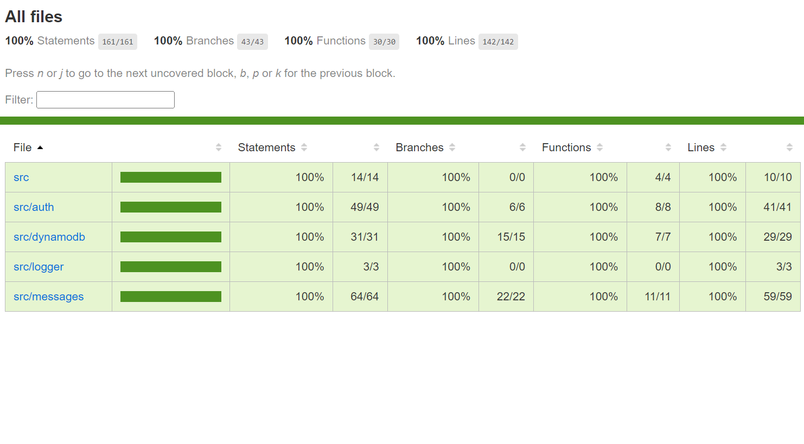
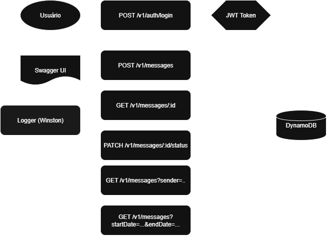

# 📬 Messages API (NestJS + DynamoDB Local + JWT Auth)

API RESTful para gerenciamento de mensagens com autenticação JWT, banco de dados DynamoDB Local e arquitetura preparada para escalabilidade e integração futura com frontend.

---

## Badge de cobertura e tecnologias


---

## 🔁 Cobertura de Testes 


 
---

## 🔁 Fluxograma da API


 
---

## Endpoints

### Autenticação
- `POST /v1/auth/login`: Autentica usuário e retorna JWT

### Mensagens
- `POST /v1/messages`: Cria nova mensagem
- `GET /v1/messages/:id`: Busca por ID
- `GET /v1/messages?sender=email`: Lista por remetente
- `PATCH /v1/messages/:id/status`: Atualiza status (enviado, recebido, lido)
- `GET /v1/messages?startDate=YYYY-MM-DD&endDate=YYYY-MM-DD`: Lista por período

---

## Coleção Postman

Importe a coleção no Postman para testar os endpoints:

📥 [Download da coleção Postman](./postman/messages-api-collection.json)


## Estrutura

```bash
src/
├── auth/               # Módulo de autenticação JWT
├── messages/           # CRUD de mensagens
├── dynamodb/           # Conexão com DynamoDB
├── logger/             # Winston logger
├── swagger.ts          # Configuração do Swagger (documentação da API)
├── app.module.ts       # Módulo principal da aplicação
├── main.ts             # Bootstrap da aplicação
---
```
## Requisitos

- Node.js >= 18
- Docker e Docker Compose
- AWS CLI (opcional, para interações locais)

---

## Variáveis de Ambiente `.env`

```
# Configuração DynamoDB Local
DYNAMO_ENDPOINT=http://dynamodb-local:8000
AWS_REGION=us-east-1
AWS_ACCESS_KEY_ID=fake
AWS_SECRET_ACCESS_KEY=fake

# Configuração para produção (descomente e configure para usar na nuvem)
# DYNAMO_ENDPOINT=https://dynamodb.us-east-1.amazonaws.com
# AWS_REGION=us-east-1
# AWS_ACCESS_KEY_ID=SEU_ACCESS_KEY_ID_AQUI
# AWS_SECRET_ACCESS_KEY=SEU_SECRET_ACCESS_KEY_AQUI

# Configuração Auth (apenas desenvolvimento/testes)
USERNAME=test.user@empresa.com
PASSWORD=SuP3rS3nh@
JWT_SECRET=jwt_secreto_para_teste_apenas_123
JWT_EXPIRES_IN=3600s

```
---

## Instalação

```
# Clone o projeto
git clone https://github.com/talitacode/messages-api.git
cd messages-api

```
---

## Executar com Docker (DynamoDB Local)

```
npm run dev:docker

```

⚠️ *Observação:* A aplicação depende do DynamoDB Local para funcionar corretamente. Recomendamos executar via Docker para garantir que o banco local esteja ativo.

---

## Documentação Swagger

Acesse em: http://localhost:3000/docs

---

## Testes Automatizados

```bash
# Testes unitários
npm run test

# Testes e2e
npm run test:e2e

# Cobertura de testes
npm run test:cov
```


